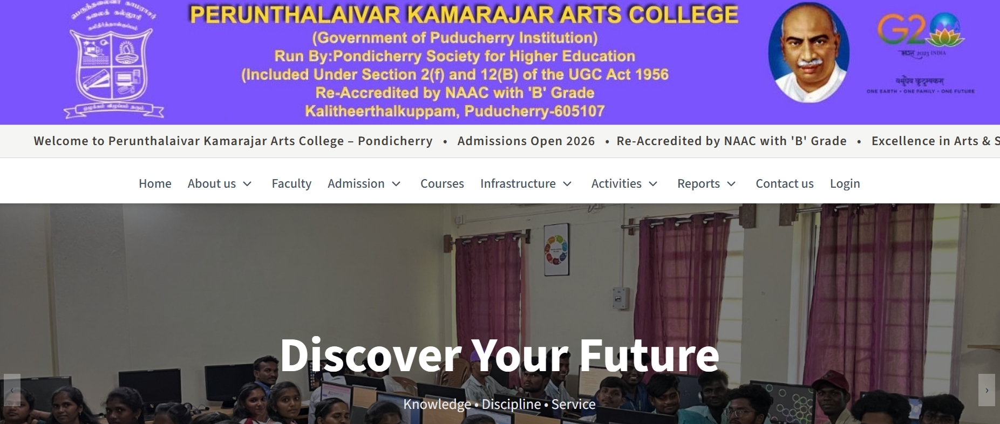

# Perunthalaivar Kamarajar Arts College

A static website for Perunthalaivar Kamarajar Arts College, built to showcase the institution's academics, admissions, and campus information.

## Features

- **Responsive Design** - Mobile-friendly interface
- **Academic Information** - Departments, courses, and programs
- **Admissions** - Enrollment details and requirements
- **Campus Facilities** - Overview of college infrastructure
- **Contact & Directions** - Location and communication channels
- **News & Updates** - Latest college announcements

## Project Structure

```
|── faculty_images
|── images
|── infrastructure
|── pdfs
|── README.md
├── src/
│   ├── index.html
│   ├── about.html
│   ├── academics.html
│   ├── admissions.html
│   ├── campus.html
│   └── etc.
├── package.json
├── package-lock.json
└── etc.
```

## Technologies Used

- HTML5
- CSS3 & Tailwindcss
- JavaScript

## Screenshots



## Installation

1. Clone the repository
2. Open `index.html` in a web browser
3. No build process required

## Contributing

For contributions, please submit a pull request with your changes.

## License

All rights reserved © Perunthalaivar Kamarajar Arts College
